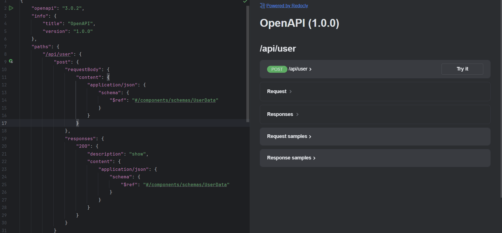

# OpenAPI Generator using Laravel Data

Generate OpenAPI specification from Laravel routes and Laravel Data objects

**This repository is just fork from original. Thanks to this person.**
Original `xolvio/laravel-data-openapi-generator`
and this package work with `spatie/laravel-data` and
`phpdocumentor/reflection-docblock`


# Install

In `composer.json` add this repository:

```json
    "require": {
          "lanser/laravel-openapi-generator" : "^1.5"
    },
```

and

```php
    composer update
```

## Version

Add a `app.version` config in `app.php` to set the version in the openapi specification:
```php
    'version' => env('APP_VERSION', '1.0.0'),
```


# Usage

## Config

`php artisan vendor:publish --tag=openapi-generator-config`

## Generate

`php artisan openapi:generate`

## View

Swagger available at `APP_URL/api/openapi`

#### On your request
```php
use Lanser\LaravelApiGenerator\Request\RequestData;

class UserRequest extends RequestData
{

    public function __construct(
        public string $name,
        public string $email
    )
    {
    }


    public static function rules(ValidationContext $context): array
    {
        return [
            'name' => ['required', 'string'],
            'email' => ['required', 'email'],
        ];
    }

}
```


#### On your resource
```php
use Lanser\LaravelApiGenerator\Response\ResponseData;

class UserResponse extends ResponseData
{

    public function __construct(
        public string $name,
        public string $email
    )
    {
    }
}
```

### Final result



### For Rout grouping
```php
Route::group(['as' => 'user'], function () {
    Route::post('/', [Controller::class, 'show']);
});
```


### For add auth
```php
Route::group(['as' => 'user'], function () {
    Route::post('/', [Controller::class, 'show']);
})->middleware('auth:sanctum');

```